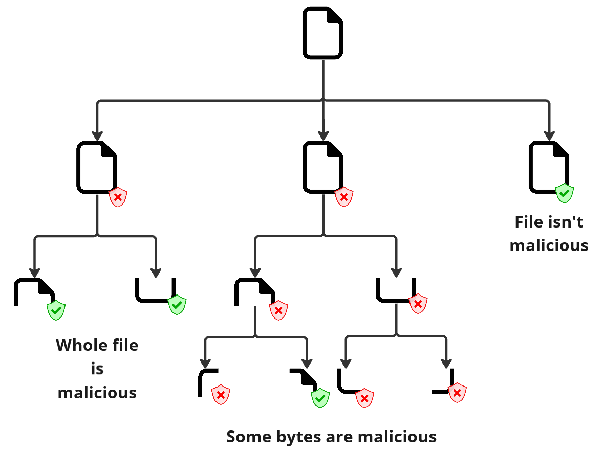

MultCheck works by submitting a file to to a given antivirus engine and then checking if it's flagged as malicious. If the file is flagged as malicious, the tool will devide the file into smaller chunks and submit each chunk to the antivirus engine. The tool does this until it finds the smallest chunk that is flagged as malicious by using a binary search algorithm as seen in the image below.

To enable the flagging of malicious files, the tool runs the antivirus scanner and retrieves key information from the scanner's output. This information is then used to determine if the file is flagged as malicious and is provided by a configuration file, defined by the user for each antivirus engine.