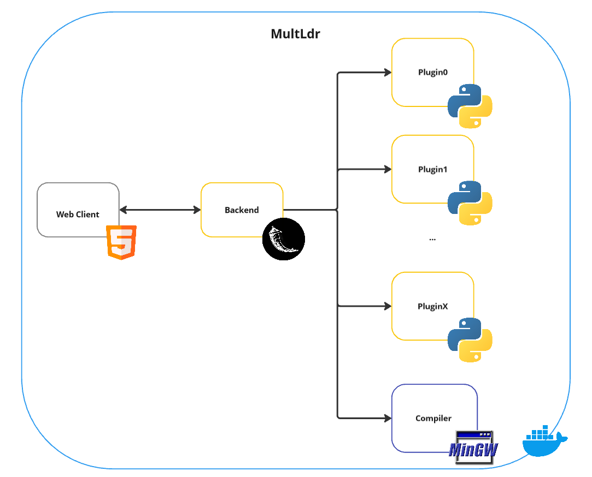
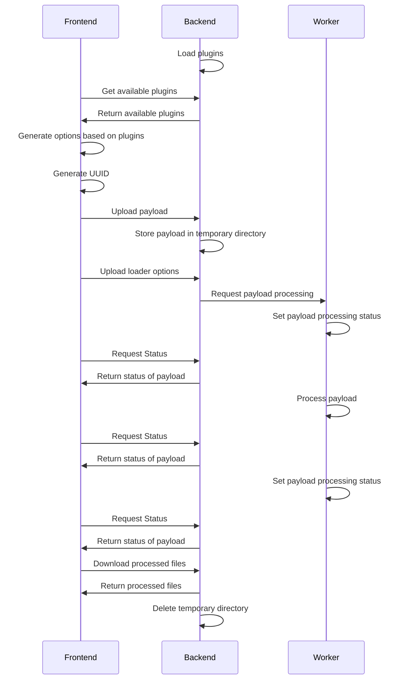

The backend of MultiLoader is a simple REST API that allows you to upload files, upload loader options and download the files with the loader options applied. The frontend is a simple web interface that allows you to interact with the API. The frontend is built using simple html, css and javascript. The backend is built Flask, a python web framework.

## Architecture



The architecture of MultiLoader is simple. A web client interacts with the backend API to upload files and loader options. The backend API stores the payload in a temporary directory with the name of the session id. The session id is a unique identifier for the session created by the user. The session id is used to identify the related files and loader options. The backend API then processes the files with the loader options and stores the processed files in the temporary directory. The processed files are then available for download by the user.

## Components

### Frontend

The frontend is a simple web generated with the help of Jinja2 templating engine. It is dynamically generated based on the plugins available in the backend. The frontend presents a set of options to the user, each one representing a plugin. The user can choose the plugin and upload the files to be processed. The frontend then sends the files to the backend API for processing and queries the backend API for the processed files.

### Backend

The backend provides a REST API for the frontend to interact with. The backend API is built using Flask, a python web framework. The backend API provides the following endpoints:

- `/api/v1/plugins`: Get the list of available plugins
- `/api/v1/payload/upload/<id>`: Upload the files to be processed
- `/api/v1/payload/generate/<id>`: Generate the loader with the options provided in a json array
- `/api/v1/payload/status/<id>`: Get the status of the payload, whether it is processed or not
- `/api/v1/payload/download/<id>`: Download the processed files

The ID in the endpoints is the session id generated by the frontend. The session id is used to identify the related files and loader options and should be base62 or similar encoding.

A flowchart of the process is shown below:



### Plugins

The plugins are the core of MultiLoader. The plugins are python scripts that process the files on the temporary directory. The plugins are stored in the `plugins` directory in the backend. The plugins are loaded dynamically by the backend API on the start of the server.

There are 5 types of plugins:

- `keying`: Keying plugins are used for payload execution prevention, they responsible for checking the environment and setting guardrails before the payload is executed.
- `payload_mods`: Payload mods plugins are used for modifying the format of the payload that is stored inside the loader, they can be obfuscation, compression, encryption, etc.
- `execution`: Execution plugins are used for executing the payload, the user is only allowed to select one execution plugin and this plugin is responsible for executing the payload in memory.
- `pre_comp`: Pre-compilation plugins are used for modifying the loader code before it is compiled, this can be used for adding additional metadata, reducing entropy, etc.
- `post_comp`: Post-compilation plugins are used for modifying the compiled loader, this can be used for junk code insertion, signature generation, etc.

The plugins are executed in the order presented above. The types of plugins have subtypes under them. The subtypes can be user defined and can be added to the plugin by the user, their presentation is done dynamically by the frontend. The plugins execution only respects the order of the types and not the subtypes.

Users can create their own plugins and add them to the `plugins` directory. The plugins should be python scripts that following structure:

```python
def desc():
    return "Description of what the plugin does"

def run():
    # Your code here
    return
```

The `desc` function should return a string that describes what the plugin does. The `run` function should contain the code that processes the files. The `run` function should process the files in the temporary directory and store the processed files in the temporary directory.

To add the plugin to the backend, the user should add the plugin to the `plugins` directory under the right type and subtype. The plugin should be inside a directory with the name of the plugin and the python script should be named `run.py`. An example of the plugin structure is shown below:

```bash
$ tree plugins
.
├── execution            # Type
│   ├── local            # Subtype
│   │   ├── CreateThread # Plugin name
            └── run.py   # Plugin script
<SNIP>
```

After adding the plugin, the user should restart the backend API for the plugin to be loaded. An example of this can be seen in the video below:



