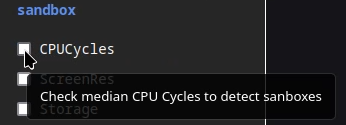

When you deploy MultLdr, you can access the MultLdr UI by navigating to the URL of the MultLdr service. The MultLdr UI is a web-based interface that allows you to upload a raw shellcode file, as the payload, and generate a loader for it. The loader is a standalone executable that can be used to execute the shellcode on a target machine, enabling you to bypass security controls and execute arbitrary code.

To use MultLdr, follow these steps:

1. Navigate to the URL of the MultLdr service in your web browser.
2. Click the **Choose File** button to upload a raw shellcode file or drag and drop the file onto the upload area.
3. Select the desired options for the loader, such as the execution method, execution guardrails (e.g., verify if it is running in a virtual machine) among others.
4. Click the **Generate Loader** button to generate the loader.

When you generate the loader, MultLdr will create a standalone executable that can be used to execute the shellcode, when done its will download the loader to your local machine.

## Example



## Tips

### Options Descriptions

When choosing the options for the loader, you can hover over the checkbox or radio button to see a description of the option. This description provides additional information about the option and how it affects the behavior of the loader and are defined by the plugin author to help the user understand the options.



### Generating a Raw Shellcode File

When generating the raw shellcode file, you can use tools such as Metasploit to generate the shellcode. For example, you can use the `msfvenom` tool to generate a raw shellcode file using the following command:

```bash
$ msfvenom -p windows/x64/exec CMD=calc.exe -f raw -o shellcode.bin
```

For more information on generating shellcode with Metasploit, see the [Metasploit documentation](https://docs.metasploit.com/docs/using-metasploit/basics/how-to-use-msfvenom.html#how-to-generate-a-payload).

### Execution Methods

When generating the raw shellcode, keep in mind the type of execution method you want to use. MultLdr supports multiple execution methods, such as within a thread or as a new process. If the execution method is process injection into another process and when the payload is executed the process crashes, try to change the options of the payload generation.

```bash
$ msfvenom -p windows/x64/exec CMD=calc.exe -f raw EXITFUNC=thread -o shellcode.bin
```