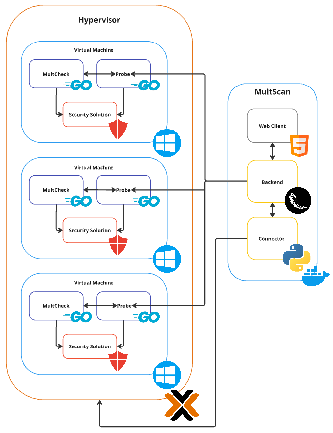

## Architecture


The architecture of MultiLoader is simple. A web client interacts with the backend API to upload samples. The backend is responsible for provisioning the infrastructure through the connector, running the probes, and verifying the detection of the samples. The backend interacts with the connector to provision the infrastructure and with the probes to verify the detection of the samples. The probes are responsible for running the samples in the given environment and verifying the detection of the samples by the security products. The probes interact with the MultCheck to extract the bytes of the sample that the security product has detected.

## Components
### Frontend
The frontend is a web view that allows users to interact with the Multiscan through a web browser. The frontend is built using HTML, CSS, and JavaScript. The frontend is responsible for rendering the user interface and sending requests to the backend through the REST API.

### Backend
The backend is a REST API that provides the necessary endpoints to interact with the Multiscan. The backend is built using Python and Flask. The backend is responsible for handling the requests from the frontend, interacting with the connector to provision the infrastructure, and interacting with the probes to verify the detection of a given sample while allowing other clients to interact with the Multiscan. The backend API provides the following endpoints:

- `/api/v1/machines`: This endpoint allows users to list all the machines that are currently present in the Multiscan configuration.
- `/api/v1/sample/upload/<id>`: This endpoint allows users to upload a sample to the Multiscan and associate it with a given id.
- `/api/v1/sample/fileinfo/<id>`: This endpoint allows users to get the file information of a given sample.
- `/api/v1/sample/scan/<id>`: This endpoint allows users to scan a given sample in the Multiscan or retrieve the status of the scan.
- `/api/v1/sample/delete/<id>`: This endpoint allows users to delete a given sample from the Multiscan.

The ID in the endpoints is the session id generated by the frontend. The session id is used to identify the related files and loader options and should be base62 or similar encoding.

A flowchart of the process is shown below:


### Connector
The connector is a plugin that allows the Multiscan to interact with the different hypervisors and cloud providers to provision the infrastructure. The connector is built using Python and is configured through the configuration file. The connector is responsible for starting and stopping the virtual machines that are used to run the probes. A template connector is the following:

```python
from app import app

connectorSettings = app.config['config']['connector']

def turnOn():
    pass

def turnOff():
    pass
```

The connector must implement the `turnOn` and `turnOff` functions to start and stop the virtual machines also any needed configuration must be done in the `config.json` file as follows:

```yml
config:
  connector:
    type: "example"
    url: "https://example.example.com:8006/api2/json"
    user: "root@pam"
    password: "password"
  machines:
    - name: "machine1"
      ip: "10.10.10.10"
    - name: "machine2"
      ip: "10.10.10.11"
```

In this example, the connector is of type `example` and the needed url, user, and password are provided. Also, the machines that are going to be used are provided. To create a new connector, the `connector_type.py` file must be created in the `connector` folder as follows:

```bash
$ tree webapp
webapp
├── app
<SNIP>
├── config.yml
├── connectors
│   ├── example_type.py
├── requirements.txt
├── run.py
├── uploads
└── utils
<SNIP>
```

### Probe
The probe is a small binary, located at the startup folder so it can be run at startup, it is responsible for running the samples in the given environment and verifying the detection of the samples by the security products.

The probe first listens for tasks provided by the backend and then downloads the sample and runs it in the given environment, after downloading the sample, checks if the security solution deleted the threat and if it did, it extracts the bytes of the sample that the security product has detected if the detection was through a static analysis. If the sample isn't deleted, the probe will then run the sample in the given environment and check if the security product detects the sample dynamically.

### MultCheck
The MultCheck is a small library , used by the probe, that allows each probe to extract the bytes of the sample that a given security product has detected. The MultCheck relies on the configuration file to extract the bytes of the sample. The configuration file must be provided to the Probe and any needed configuration must be done in the `config.json` file as follows:

```yml
{
  "cmd": "& 'C:\\ProgramData\\Microsoft\\Windows Defender\\Platform\\4.18.24050.7-0\\MpCmdRun.exe' -Scan -ScanType 3 -File '{{file}}' -DisableRemediation -Trace -Level 0x10",
  "out": "Threat information"
}
```